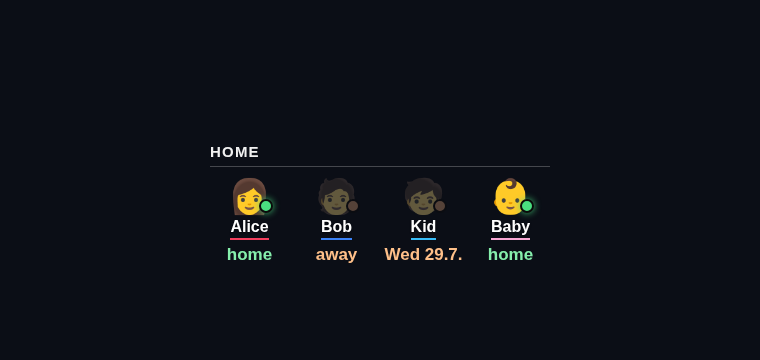

# MMM-FamilyPresence

A [MagicMirror²](https://magicmirror.builders/) module showing **household presence** in a
single row — one avatar per person with a short **home / away** status.



Each person's status comes from one of three sources:

- **`network`** — a `home` flag from a presence `data.json` you feed the module (for example
  generated from your router's DHCP leases). A sample `data.json` is included.
- **`calendarNext`** — *home* while a matching calendar event runs; otherwise *away*, showing
  the next matching date. (Great for "child stays every other week".)
- **`calendarAway`** — *home* by default; *away* only while a matching calendar event runs
  (the label is the event title minus the prefix, e.g. "at grandma's").

Calendar sources listen to the standard MagicMirror `CALENDAR_EVENTS` broadcast, so add the
built-in `calendar` module with the relevant feed(s).

## Installation

```bash
cd ~/MagicMirror/modules
git clone https://github.com/ago1776/MMM-FamilyPresence
```

```js
{
  module: "MMM-FamilyPresence",
  position: "bottom_right",
  config: {
    title: "Home",
    people: [
      { name: "Alice", emoji: "👩", color: "#f43f5e", source: { type: "network", key: "alice" } },
      { name: "Bob",   emoji: "🧑", color: "#3b82f6", source: { type: "network", key: "bob" } },
      { name: "Kid",   emoji: "🧒", color: "#38bdf8", source: { type: "calendarNext", prefix: "kid" } },
      { name: "Baby",  emoji: "👶", color: "#f9a8d4", source: { type: "calendarAway", prefix: "baby" } }
    ]
  }
}
```

## Presence data (`data.json`)

```json
{ "persons": { "alice": { "home": true }, "bob": { "home": false } } }
```

Your own script overwrites this file; `source.key` selects the entry per person.

## Configuration options

| Option           | Type   | Default                                  | Description                                            |
| ---------------- | ------ | ---------------------------------------- | ------------------------------------------------------ |
| `title`          | string | `"Home"`                                 | Header title.                                          |
| `people`         | array  | *(4 examples)*                           | People with `name`, `emoji`, `color`, `source`.        |
| `labels`         | object | `{home:"home",away:"away",unknown:"—"}`  | Status label texts.                                    |
| `locale`         | string | `null`                                   | Locale for the "next date" (null = browser default).  |
| `updateInterval` | number | `60000`                                  | How often `data.json` is re-read (ms).                 |

## License

MIT © Andreas Göpfert

